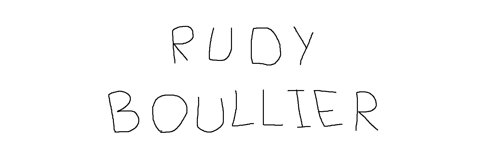

  

###

<h3 align="left">👩‍💻  About Me</h3>

###

I'm a fullstack web developer from France 🇫🇷  - 🎓 I'm student in BUT Informatique at IUT Lyon 1 - 📚 I'm currently learning Computer Science - ⚡ In my free time I'm coding

###

<h3 align="left">🛠 Language and tools</h3>

###

  
  
  
  
  
  
  
  
  
  
  
  
  
  
  
  
  
  
  
  
  
  

###

<h3 align="left">🔥   My Stats :</h3>

###

    
  

###
